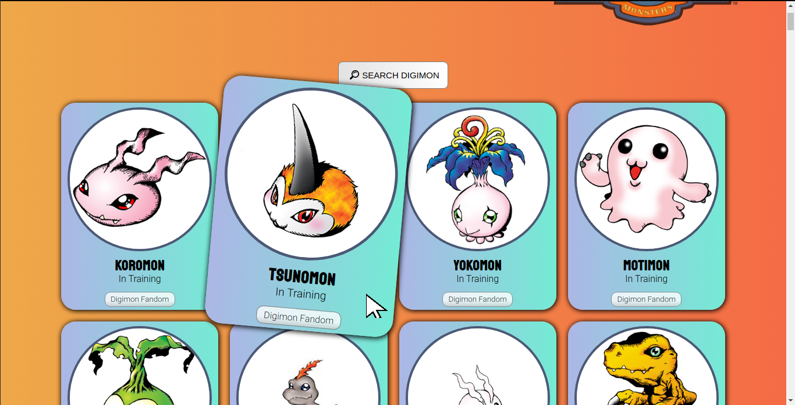

# Digidex v1.0
> This repository is the result of my javascript studying. Saw a Pokedex version made by Roger Melo and tought it was a good idea to engage on my own project to practice the concepts learned.

## Goals with this project
Better understanding of:
- Promises
- Fetch/catch functions
- Http requests
- CSS tricks
- General javascript using


Essentialy, this Digidex application is feeded by a digimon api, with 209 types of Digimon's. The app function is to get all oh those characters on screen and display it's type and name. Also put a digimon fandom link to each one of them, if the person wants to know more information about the digimon in question.


## Installation
- Install **live server** extension for vscode

## Usage
```
- Check digimon info by scrolling or searching the page

- Direct access to Digimon Fandom page, according to chosen Digimon
```



## Development setup

Describe how to install all development dependencies and how to run an automated test-suite of some kind. Potentially do this for multiple platforms.


## Release History

* 1.0
    * Page with all digimons and a search function

## Meta

Álvaro Patrício – [LinkedIn page](https://www.linkedin.com/in/alvaropsouza/) – alvaropatricio61@gmail.com

[https://github.com/alvaropsouza/digidex-1.0](https://github.com/alvaropsouza/digidex-1.0)